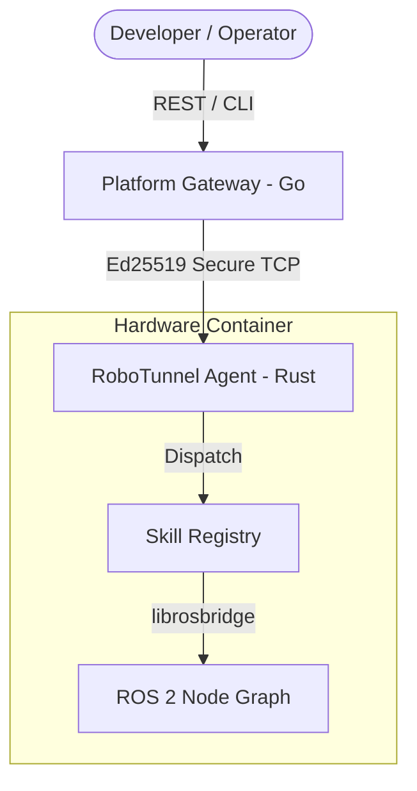

# RoboTunnel Agent (v0.2.0-stable)

> **The "Physical World API Layer"**: Transform your robots and IoT devices into LLM-callable functions.

RoboTunnel Agent is a high-performance, modular Rust runtime that bridges the gap between high-level AI (LLM) and low-level hardware (ROS 2/Serial). It provides a secure, encrypted tunnel for remote debugging, monitoring, and real-time execution.

---

## 🚀 Core Value Proposition

- **AI-Native**: Designed for LLM tool-calling. Every robot capability is exposed as a structured "Skill".
- **Security First**: 
    - **Ed25519 Handshake**: Cryptographic challenge-response for every connection.
    - **Privacy**: LLM API Keys are encrypted and stored **locally** on the agent. No keys pass through our cloud.
- **DDS/ROS 2 Bridging**: Seamlessly proxy ROS 2 topics and services over the tunnel.
- **Resource Efficient**: Written in pure Rust. Minimal CPU/RAM footprint, suitable for edge devices (Jetson, Raspberry Pi).

## 🏗 Architecture (v0.2.0)



## 🛠 Features

- **Remote Debugging**: Direct shell/log access via secure tunnel.
- **Fleet Monitoring**: Real-time health-check and anomaly detection pushed to your Discord/Slack.
- **Skill System**: 
  - `rt-skill-debug`: System logs, process management.
  - `rt-skill-ros2`: Topic discovery, sub/pub, and data downsampling.
- **Zero-Trust Connection**: No open ports required on the robot if used with our Relay (coming in v0.3.0).

## 🚦 Getting Started

### 1. Build from Source
```bash
git clone https://github.com/robotunnel/robotunnel-agent.git
cd robotunnel-agent
cargo build --release
```

### 2. Configuration
The agent is configured via `config/agent.toml` or environment variables:
```toml
[server]
port = 11411
auth_seed = "..." # Ed25519 Seed

[platform]
api_url = "https://api.robotunnel.io"
```

### 3. Running
```bash
./target/release/rt-agent
```

## 🔐 Security & Trust
We understand that robot control is critical. 
- **Key Storage**: All third-party secrets (OpenAI Key, etc.) are encrypted using a local HW-bound key.
- **Open Source**: The entire agent logic is transparent and auditable.

## 🗺 Roadmap (v0.3.0)
- **WebRTC P2P**: Direct MAC-to-Robot streaming with STUN/TURN fallback.
- **Multi-LLM Integration**: Built-in support for Claude, OpenAI, Deepseek, and more.
- **Automated UAT**: LLM-driven verification of robot tasks.

---

## 📄 License
MIT License. See [LICENSE](LICENSE) for details.

## 🤝 Community
- **GitHub**: [robotunnel/robotunnel-agent](https://github.com/robotunnel/robotunnel-agent)
- **Contact**: [russellshe@gmail.com](mailto:russellshe@gmail.com)
