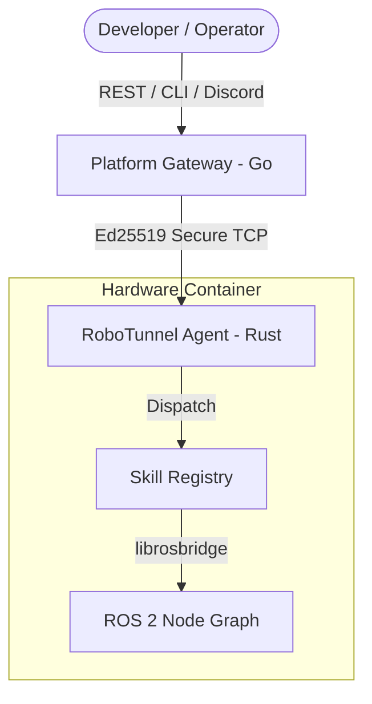

# RoboTunnel Agent (v0.2.0-stable)

# 🌐 The Physical World API Layer
**Transform your robots and IoT devices into LLM-callable functions. Secure, modular, and AI-native.**

---

RoboTunnel Agent is a high-performance, modular Rust runtime that bridges the gap between high-level AI (LLM) and low-level hardware (ROS 2/Serial). It provides a secure, Ed25519-encrypted tunnel for remote debugging, monitoring, and real-time execution.

## 🏗 Architecture



## 🔐 Security & Trust (Local-First)
We believe robot control must be zero-trust.
- **Ed25519 Handshake**: Every connection requires a cryptographic challenge-response.
- **Local-First Keys**: All third-party secrets (OpenAI, Claude, etc.) are encrypted and stored **locally** on the agent. We never transit or store your API keys on our cloud.
- **Auditability**: Pure Rust implementation with no hidden binary blobs.

## 📋 Prerequisites
- **OS**: Ubuntu 20.04+ / Debian 11+ (Linux is required for ROS 2 integration).
- **Rust**: 1.75+ (Stable).
- **ROS 2**: Humble / Iron / Jazzy (Sourced in your environment).

## 🚀 Getting Started (4 Steps to Connect)

### 1. Get your Authorization Token
Currently, we are in a developer-invite phase. Contact [russellshe@gmail.com](mailto:russellshe@gmail.com) to receive your `RT_KEY` and Platform API Key.

### 2. Install the RoboTunnel CLI
The CLI is the management hub for your development machine. Since the main repository is private, download the pre-compiled binary for your architecture:
- [Download for macOS (Apple Silicon)](https://github.com/RussellTNY/robotunnel/releases)
- [Download for macOS (Intel)](https://github.com/RussellTNY/robotunnel/releases)
- [Download for Linux (amd64)](https://github.com/RussellTNY/robotunnel/releases)

```bash
# Example for macOS
chmod +x robotunnel-darwin-arm64
sudo mv robotunnel-darwin-arm64 /usr/local/bin/robotunnel
```

### 3. Build & Launch the Agent
On your **Robot**, build the agent and start it using your registration key.
```bash
# Clone the Agent (Open Source)
git clone https://github.com/RussellTNY/robotunnel-agent.git
cd robotunnel-agent
cargo build --release

# Start the agent
RT_KEY="your_rt_key_here" ./target/release/robotunnel-agent
```

### 4. Verify the Connection
On your **Local Machine**, initialize the CLI and list your robots.
```bash
$ robotunnel init "your_platform_api_key"
$ robotunnel list

ROBOT IP           STATUS     LAST SEEN
--------------------------------------------------
192.168.1.105      🟢 Online  Just now
```

---

## 💡 Usage Scenarios

### ⚡ Real-Time Control (LAN)
Use the CLI for high-bandwidth tasks like ROS 2 topic echoes:
```bash
robotunnel connect 192.168.1.105
# Now you can use Foxglove or standard ROS 2 tools locally.
```

### 🤖 Remote Management (WAN / Discord)
For robots behind firewalls, use the **ChatOps** interface. Since commands are routed via the Platform Gateway, you can check status from anywhere:
- **Discord**: Type `rt status` to see battery and system health.
- **AI-Native**: Ask `Why is robot #3 moving slowly?` for an LLM-driven fleet comparison.

## 🛠 Features (v0.2.0)
- **Hybrid Connectivity**: High-speed LAN tunneling + reliable WAN ChatOps.
- **Fleet Monitoring**: Real-time heartbeat and anomaly detection.
- **Modular Skills**:
    - `rt-skill-debug`: System metrics, logs, and processes.
    - `rt-skill-ros2`: Direct ROS 2 topic proxy.

## 🗺 Roadmap (v0.3.0)
- **WebRTC P2P**: High-bandwidth data streaming (Lidar/Camera) over WAN with STUN/TURN fallback.
- **Unified Site**: Global dashboard for robot management and subscription.
- **Multi-LLM Integration**: Use your own API keys for GPT-4, Claude, and more.

---

## 📄 License
MIT License. See [LICENSE](LICENSE) for details.

## 🤝 Community
- **GitHub**: [RussellTNY/robotunnel-agent](https://github.com/RussellTNY/robotunnel-agent)
- **Contact**: [russellshe@gmail.com](mailto:russellshe@gmail.com)
